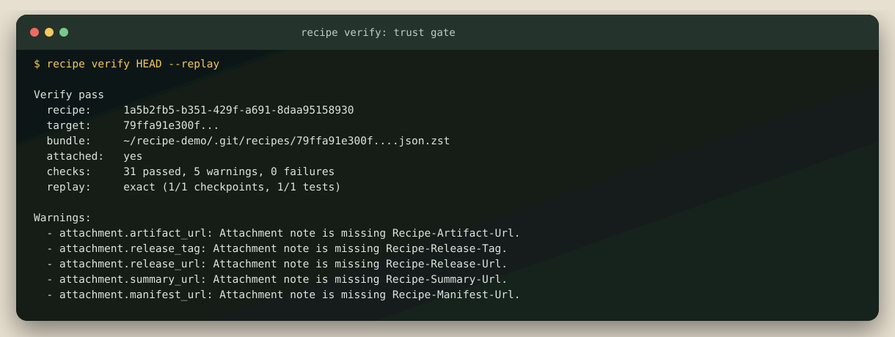

# recipe

`recipe` is a local-first prototype for replayable AI commit provenance.

It treats an AI-assisted commit like a build artifact that deserves a source map:

- what the user asked
- what the agent did
- what changed at each step
- what tests ran
- whether we can deterministically replay the result on the original base

## 60-second quickstart

Install the current checkout once:

```bash
npm install -g .
```

Then, from any clean Git repository with at least one commit:

```bash
recipe init
recipe doctor
recipe run --commit --prompt "Fix the parser bug" -- codex
recipe inspect HEAD --timeline
recipe replay HEAD
```

`recipe run` forwards every argument after `--` directly to the agent without a shell. Agent-created commits finalize and attach automatically. Dirty output is never silently committed: interactive runs ask for confirmation, while automation must pass `--commit`. Without consent, Recipe preserves the changes and exits `2` as `awaiting_commit`. No session ID, checkpoint command, schema file, or separate publish step is required.

Failed agent processes are not committed. Their checkpoints remain local and can be continued or discarded without finding a session ID:

```bash
recipe run --resume --prompt "Try the smaller fix" -- codex
recipe run --abort
```

## What it looks like




## Current scope

This repository is currently in private preview while the launch package receives its final review.

- Bundles are stored in `.git/recipes/<target-commit>.json.zst`
- `recipe init` stores local configuration under `.git/recipe/` and composes a managed block into the effective shell `post-commit` hook without changing `core.hooksPath`
- `recipe run` stores its attachment artifacts under `.git/recipe-publish/`
- Live capture sessions are stored in `.git/recipe-sessions/<session-id>/`
- Raw transcripts stay local
- `recipe publish` generates shareable local artifacts and attaches trailer-style metadata to the commit through `refs/notes/recipe`
- publish artifacts now include a reviewer comment template and a machine-readable manifest with exact local inspect/replay commands
- Codex and Claude adapters are thin wrappers over the same concrete local recorder and JSONL ingest surface

## CLI

```bash
recipe init
recipe doctor
recipe status
recipe run --commit --prompt "Fix calc" -- codex
recipe run --commit --prompt "Refactor parser" -- claude
recipe run --no-commit --prompt "Capture without committing" -- aider
recipe run --resume -- codex
recipe run --abort

# Lower-level recorder surfaces remain available for adapter authors
recipe codex start --prompt "Fix calc"
recipe codex step --session <id> --prompt "Apply the change" --command "node scripts/edit.js"
recipe codex observe --session <id> --prompt "Apply the change" --command "codex run ..."
recipe codex test --session <id> --command "npm test"
recipe codex finalize --session <id> --target HEAD
recipe hooks install
recipe hooks status
recipe hooks uninstall

# Claude uses the same recorder with a different source-agent label
recipe claude start --prompt "Refactor parser"

recipe capture --start --source-agent codex --base HEAD --prompt "Fix calc"
recipe capture --checkpoint --session <id> --summary "Apply agent edits"
recipe capture --record-test --session <id> --command "npm test"
recipe capture --finalize --session <id> --target HEAD

# draft import still works too
recipe capture --input work/example-recipe.json
recipe resolve pr:123 --json
recipe inspect <commit>
recipe inspect pr:123
recipe inspect pr:123#45
recipe inspect pr:123@abcdef12
recipe inspect <commit> --timeline
recipe replay <commit>
recipe replay pr:123
recipe diff-replay <commit>
recipe publish <commit>
recipe publish <commit> --release-tag recipe-artifacts
recipe github sync-pr --pr 123 <commit>
recipe verify <commit> --replay
recipe verify pr:123 --replay
recipe inspect https://github.com/owner/repo/releases/download/recipe-artifacts/<bundle>.json.zst
recipe inspect <commit> --line src/file.js:42
```

By default, `recipe publish HEAD` will also attach a local git note to the target commit containing:

- the recipe trailer block
- the notes ref used for attachment
- repo-relative paths to the bundle and publish artifacts

The local artifact set is now:

- `outputs/<commit>.recipe.md`
- `outputs/<commit>.trailers.txt`
- `outputs/<commit>.recipe.json.zst`
- `outputs/<commit>.recipe-comment.md`
- `outputs/<commit>.recipe-publish.json`

If you run `recipe publish HEAD --verify --replay`, the reviewer comment and manifest also embed the current verification and replay status.

`recipe github sync-pr --pr 123 HEAD` reuses those publish artifacts and upserts one sticky recipe comment onto a PR through `gh`, so later runs update in place instead of creating comment spam.

If you add `--release-tag recipe-artifacts`, the structured bundle, summary, and manifest are also uploaded to a GitHub release asset bucket, and the generated comment/manifest switch to durable download URLs.

Once a PR is synced, `pr:<number>` becomes a first-class recipe ref. `recipe inspect pr:123`, `recipe verify pr:123`, and `recipe replay pr:123` will resolve through the synced comment first and fall back to the PR head commit when no recipe comment exists yet.

If a PR has more than one synced recipe trace, you can select explicitly:

- `pr:123#45` picks comment `#45`
- `pr:123@abcdef12` picks the recipe whose target commit starts with `abcdef12`

The synced PR comment also carries hidden machine-readable recipe metadata. That lets the resolver recover the manifest or hosted bundle URL even if the visible markdown gets edited or trimmed later.

For CI or automation, `recipe resolve pr:123 --json` returns the selected recipe source plus the structured PR/comment/manifest/release metadata that led to that choice.

When a commit has that attachment note, `recipe inspect HEAD` and `recipe replay HEAD` can fall back to the attached artifact path or remote artifact URL even if the local `.git/recipes/<commit>.json.zst` bundle is gone.

`recipe inspect HEAD --line path/to/file.js:42` behaves like a source map lookup: it reports the checkpoint that introduced the final-tree line, the causal step behind that checkpoint, and the nearest captured prompt. Later insertions and deletions rebase earlier ownership; renames preserve it, while deleted and binary lines intentionally return no attribution.

`recipe inspect HEAD --timeline` turns the event stream into a step-by-step provenance story: prompt, action, checkpoints, touched files, and tests. The published markdown summary now uses that same derived timeline so the local review artifact reads like a commit recipe instead of a raw log dump.

## Privacy behavior

The prototype now distinguishes between:

- non-replay-critical text, which is redacted when it looks secret-like
- replay-critical fields such as patches and final replay diffs, which are preserved but flagged

Non-replay-critical strings are capped at 16 KiB after redaction, with deterministic truncation metadata. Replay-critical patches, final diffs, and test commands are never truncated; values over 1 MiB produce an explicit finding instead. Public omission records are path-free, and raw transcripts remain local-only.

The frozen `0.1.0` compatibility and privacy contract is documented in [the trust model](docs/trust-model.md). Phase 1's executable exit evidence is in [the verification record](docs/phase-1-verification.md).

Mixed authorship is also replay-aware now: `human_edit` checkpoints are treated as first-class replay steps alongside agent-generated checkpoints, so AI-plus-human commits can be reproduced end to end instead of only replaying the agent portion.

## Verification

`recipe verify` is the local trust gate for a captured commit:

- validates the recipe bundle against the open schema
- recomputes the canonical `targetSha256`
- checks attached note fields against the resolved recipe
- verifies published artifacts are present and readable
- optionally reruns deterministic replay and recorded tests with `--replay`

That gives a reviewer one command for “is this recipe intact?” instead of manually combining `inspect`, `validate`, and `replay`.

Replay reports tree status (`exact`, `mixed`, or `drifted`) separately from test agreement. Overall success, and a zero exit code from `replay` or `diff-replay`, requires an exact tree and every recorded test outcome to match.

The same commands now also work against a hosted bundle URL, not just a local file or commit ref:

```bash
recipe inspect https://github.com/owner/repo/releases/download/recipe-artifacts/<bundle>.json.zst
recipe verify https://github.com/owner/repo/releases/download/recipe-artifacts/<bundle>.json.zst
recipe replay https://github.com/owner/repo/releases/download/recipe-artifacts/<bundle>.json.zst
```

## GitHub bridge

The prototype is still local-first, but it now has a backendless PR handoff:

```bash
recipe github sync-pr --pr 123 HEAD --replay
recipe github sync-pr --pr 123 HEAD --replay --release-tag recipe-artifacts
```

That flow:

- republishes the local recipe artifacts if needed
- keeps the commit-attached git note in sync
- verifies the recipe by default
- pushes the generated reviewer comment to the PR through `gh`
- updates the same comment on later runs by matching a hidden recipe marker
- can optionally upload the structured bundle to a GitHub release asset bucket and link the PR comment to that public artifact

## Low-level recorder flow

The underlying recorder flow remains available for adapter authors:

1. Start a session against a base commit.
2. Append prompts or generic events as the agent works.
3. Capture incremental checkpoints from the working tree after meaningful edits.
4. Record test commands and outcomes.
5. Finalize against the target commit to write the compressed recipe bundle.

Most developers should use `recipe run`. The lower-level flow keeps the adapter contract thin: a Codex or Claude bridge only needs to emit prompt, tool, shell, checkpoint, and test events into the recorder.

## Thin adapters

Two local adapter surfaces now sit on top of the recorder:

- `recipe codex ...`
- `recipe claude ...`

They are intentionally thin wrappers, not deep IDE integrations. Their job is to:

- prefill the agent identity
- record shell steps as `shell_command`
- auto-capture resulting file diffs as checkpoints
- finalize into the same shared `recipe.json` bundle format

They also support streamed import now. A future live adapter can pipe JSONL records into an active session instead of driving one CLI call per step:

```bash
recipe codex start --json
cat events.jsonl | recipe codex ingest --session <id> --stdin
```

Supported streamed record kinds include:

- `prompt`
- `transcript`
- `shell`
- `tool`
- `test`
- `checkpoint`
- generic `event`

For CLI-based agents, `observe` is the closer bridge. It wraps a real command, streams stdout/stderr into the local transcript, records the shell step, and snapshots the resulting diff into a causal checkpoint:

```bash
recipe codex observe --session <id> --command "codex run ..."
recipe claude observe --session <id> --command "claude ..."
```

## Open spec

The implementation now publishes a formal open spec alongside the runtime behavior:

```bash
recipe schema recipe
recipe schema ingest-record
recipe schema ingest-stream
recipe validate recipe HEAD
recipe validate ingest events.jsonl
```

That gives external Codex or Claude adapters two stable targets:

- the `recipe.json` bundle shape
- the streamed ingest record shape

## Commit automation

For the local-only prototype, the closest thing to a live integration is git-hook automation:

```bash
recipe hooks install
recipe codex start --prompt "Fix calc"
recipe codex step --session <id> --command "node scripts/edit.js"
git add .
git commit -m "target"
```

With hooks installed, an active agent session is finalized automatically on `git commit`, then published and attached to the new commit through `refs/notes/recipe`. That gives the commit a carryable local recipe without requiring a separate manual `finalize` or `publish` step.

## Draft schema

The v1 bundle centers on a versioned `recipe.json` with:

- `metadata`
- `repo`
- `instructions`
- `events`
- `outputs`
- `privacy`

See the source in `src/core/schema.js` and `src/core/recipe.js` for the current normalization rules.
