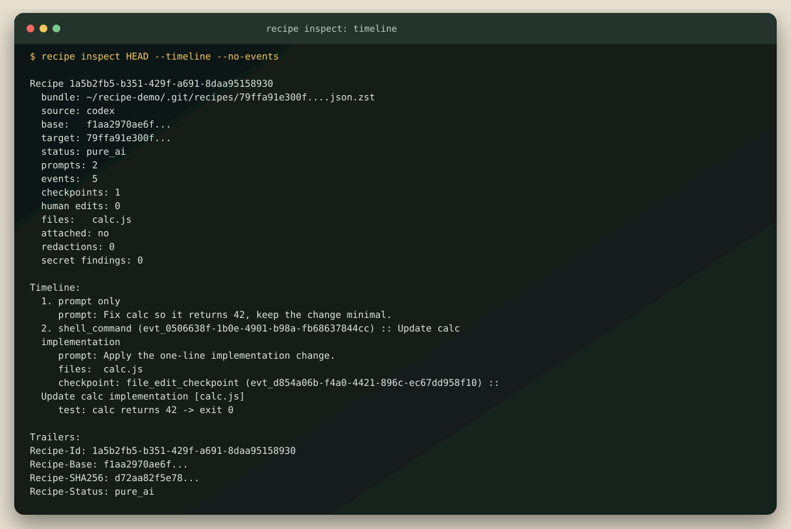
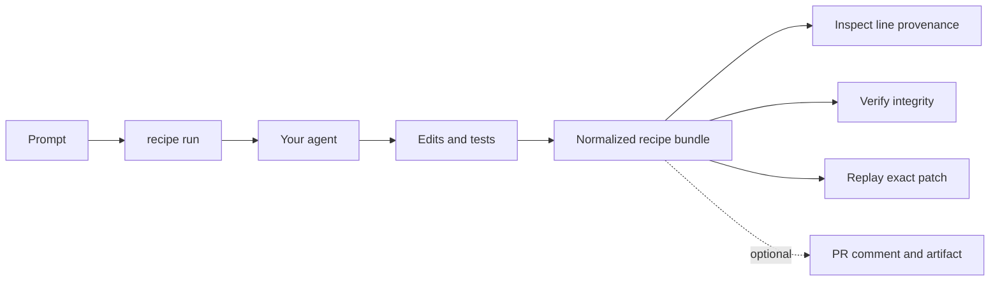

# Recipe

**Source maps for AI-generated commits.** Capture what produced a change, attribute lines to steps, and deterministically replay the exact patch from its original base.

[](https://github.com/vivekparekh8/recipe/actions/workflows/ci.yml)
[](LICENSE)
[](package.json)

> **Public early preview:** the workflow works end to end, but the CLI and schema may change before 1.0.

Recipe wraps the agent you already use. It records public-safe provenance, lets reviewers ask “which step created these lines?”, and replays captured checkpoints instead of hoping a model regenerates the same answer.

**Proof, not a mockup:** three fixes against real open-source issues, three exact replays, and three independently restorable demo packages. [Review the evidence](demos/README.md).

## Try it in 60 seconds

Requires Git, Node.js 22+, and a repository with at least one commit. Install directly from GitHub while the npm package is being prepared:

```bash
npm install --global https://github.com/vivekparekh8/recipe/archive/refs/heads/main.tar.gz
```

Then run Recipe around Codex, Claude Code, Aider, or another command:

```bash
cd your-repository
recipe init
recipe doctor
recipe run --commit --prompt "Fix the parser bug and run its focused test" -- codex exec --full-auto
recipe inspect HEAD --timeline
recipe verify HEAD --replay
```

Everything after `--` is forwarded unchanged and without a shell. Recipe creates the commit only because `--commit` was explicit. If the agent creates its own commit, Recipe attaches to that commit instead.



## Why Recipe

- **Review intent, not just output.** Inspect prompts, actions, checkpoints, tests, and mixed human/agent authorship.
- **Trace lines to causes.** `recipe inspect HEAD --line src/parser.js:42` finds the checkpoint, causal step, and nearest prompt.
- **Replay deterministically.** Recipe reapplies captured edits on the recorded base and reports `exact`, `mixed`, or `drifted`.
- **Keep sensitive history local.** Raw transcripts are never needed for sharing; normalized artifacts are redacted and bounded.
- **Avoid another service.** Storage is local Git state, attachments are Git notes, and GitHub handoff uses comments and release assets.



## Safe commit behavior

Recipe does not silently commit a dirty working tree.

| Situation | Result |
| --- | --- |
| Agent creates commits | Finalize and attach automatically |
| `--commit` is supplied | Recipe commits captured changes |
| Interactive run without a flag | Ask before committing; default is no |
| Non-interactive run without `--commit` | Preserve changes, mark `awaiting_commit`, exit 2 |
| `--no-commit` | Preserve a resumable session |
| Agent exits unsuccessfully | Never create a Recipe commit |

Resume or discard preserved work without handling session IDs:

```bash
recipe run --resume --prompt "Try the narrower fix" -- codex exec --full-auto
recipe run --abort
```

## What gets shared

| Public-safe structured recipe | Local only |
| --- | --- |
| User prompts after redaction | Raw transcript |
| Agent action summaries and required tool inputs | Unneeded tool chatter |
| Incremental edit checkpoints and line attribution | Original secret-like values |
| Test commands and outcomes | Active session internals |
| Integrity, omission, and replay status | Credentials and absolute local paths |

Replay-critical patches are preserved rather than silently truncated, and oversized values receive explicit privacy findings. See the [trust model](docs/trust-model.md) for guarantees and non-claims.

## Real OSS demos

| Repository | Issue | Focused check | Replay |
| --- | --- | --- | --- |
| emotion-js/emotion | [#3386](https://github.com/emotion-js/emotion/issues/3386) | 217 package tests passed | Exact |
| mui/material-ui | [#41067](https://github.com/mui/material-ui/issues/41067) | 113 passed, 20 skipped | Exact |
| shadcn-ui/ui | [#10543](https://github.com/shadcn-ui/ui/issues/10543) | 2 regressions passed, 8 targets built | Exact |

Each [demo package](demos/README.md) contains the prompt, before/after evidence, patch, compressed recipe, verification output, and a Git bundle for clean restoration. They are **PR-ready locally**, not published upstream; no upstream PRs or comments were created.

## Everyday commands

```bash
recipe status
recipe inspect HEAD --timeline
recipe inspect HEAD --line src/file.js:42
recipe replay HEAD
recipe diff-replay HEAD
recipe verify HEAD --replay
recipe publish HEAD
recipe github sync-pr --pr 123 HEAD --replay
recipe hooks uninstall
```

Codex and Claude Code have thin adapters over the same recorder; Aider and arbitrary CLIs work through `recipe run`. Adapter authors can stream normalized JSONL events through the lower-level capture surface.

Read the [CLI reference](docs/cli-reference.md) for GitHub handoff, PR references, schemas, streamed adapters, and low-level capture commands.

## Project status

Recipe currently ships deterministic playback, line attribution, mixed-authorship capture, safe Git hook composition, diagnostics, local/URL/PR resolution, and backendless GitHub handoff. The test suite exercises macOS, Linux, and Windows plus installation from a packed artifact.

Next priorities are a scoped npm release, signed recipe attestations, richer environment-drift diagnostics, and broader agent protocol import. See the [roadmap](ROADMAP.md).

Contributions are welcome. Start with [CONTRIBUTING.md](CONTRIBUTING.md), report sensitive problems through [SECURITY.md](SECURITY.md), or open a focused issue with a reproduction.

## License

[MIT](LICENSE)
